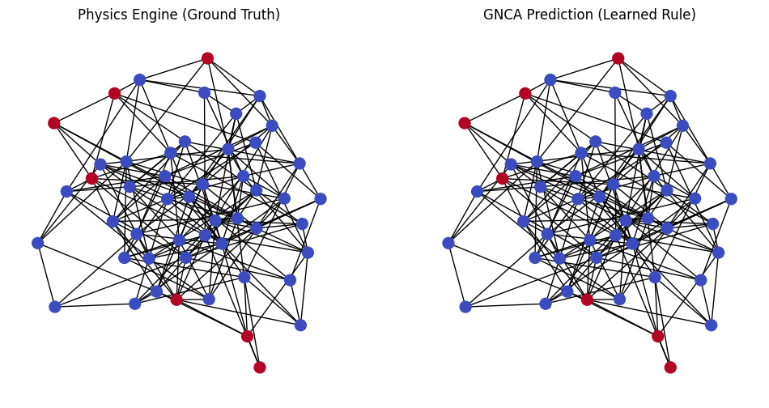

# The Hive Mind: Graph Neural Cellular Automata (GNCA)

[](https://github.com/algoplexity/algoplexity) []() []()

**Modeling Systemic Risk and Collective Intelligence via Topological Computing.**

This repository contains the implementation of **Horizon 3** of the [Algoplexity Research Program](https://github.com/algoplexity/algoplexity). It extends the "Algorithmic Worldview" from the temporal domain (Time Series) to the spatial domain (Network Topology), treating markets and societies as **Graph Neural Cellular Automata**.

---

## 🌌 The Mission: Decoding the Networked Mind

While **Horizon 1** (The AIT Physicist) diagnoses the cognitive state of a single agent, **Horizon 3** models how these states propagate across a population.

We posit that systemic crises—whether **Financial Contagion**, **Supply Chain Collapses**, or **Social Polarization**—are topological failures. They occur when the network's interaction rules shift from robust dynamics (e.g., Risk Sharing) to brittle dynamics (e.g., Synchronization or Contagion).

To study this, we replicate and extend the **Graph Neural Cellular Automata (GNCA)** framework proposed by **Grattarola et al. (NeurIPS 2021)**, adapting it from fluid dynamics to **Algorithmic Cognitive Finance**.

---

## 🔬 Current Status: The Contagion Engine (Validated)

We have successfully built and validated the core **"Systemic Topology Engine."**

### Experiment 1: Reverse-Engineering Financial Contagion
*   **The Physics:** We simulated a banking network ($N=100$) governed by a hidden **Threshold Rule** (Capital Adequacy). A bank defaults (State 1) if the weighted exposure to failing neighbors exceeds a hidden capital buffer.
*   **The Learner:** A Graph Neural Network (GNCA) was tasked with observing only the binary states ($S_t, S_{t+1}$) without knowing the topology rule or the threshold value.
*   **The Result:** The GNCA achieved **100.00% Accuracy** in predicting the propagation of insolvency on unseen random graphs.


*(Figure 1: The GNCA Prediction (Right) perfectly mirrors the Ground Truth Physics (Left), proving the model can "learn the law" of systemic risk.)*

---

## 🗺️ The Roadmap: Building the "Universal Graph Physicist"

Having validated the engine on a single rule (Contagion), our research trajectory moves toward building a **General Diagnostic Instrument** for networks.

Just as Horizon 1 identified the "Prime Rules" of Time Series (Trend vs. Chaos), Horizon 3 aims to identify the **"Prime Rules" of Network Topology**.

| Graph Prime | Physics Equivalent | Financial/Social Isomorphism | Cognitive State |
| :--- | :--- | :--- | :--- |
| **Rule A** | **Contagion** (Threshold) | Default Cascades / Viral Misinformation | **Saturation (Rule 54)** |
| **Rule B** | **Diffusion** (Average) | Risk Sharing / Consensus Formation | **Coherence (Rule 170)** |
| **Rule C** | **Synchronization** (Kuramoto) | Herding / Flash Crashes / Monoculture | **Rigidity (Class 4)** |
| **Rule D** | **Chaos** (XOR) | Panic / Fractal Shattering | **Overload (Rule 60)** |

**The PhD Goal:** To train a GNCA Classifier on these archetypes, creating a dashboard that can diagnose the **"Dynamic Regime"** of a real-world network in real-time (e.g., "The interbank market is shifting from Diffusion to Synchronization").

---

## 🛠️ Repository Structure

*   **`notebooks/`**:
    *   `01_Replication_Contagion.ipynb`: The foundational proof-of-concept. Implements `FinancialContagionCA` (Ground Truth) and `SystemicGNCA` (Learner) in PyTorch Geometric.
*   **`models/`**:
    *   `gnca.py`: The Message-Passing Neural Network architecture.
*   **`modules/`**:
    *   `ca.py`: The Physics Engines (Ground Truth Generators).
*   **`results/`**: Visualizations of network propagation and learning curves.

---

## 📚 Theoretical Foundations

This work sits at the intersection of:
1.  **Graph Neural Networks:** Specifically the *Graph Neural Cellular Automata* architecture [Grattarola et al., 2021].
2.  **Complexity Economics:** Modeling the economy as an evolving ecology of rules rather than a static equilibrium [Farmer & Skouras, 2013].
3.  **Cybernetics:** Understanding how network topology determines the viability of the "Hive Mind" [ANU School of Cybernetics, 2021].

---

## 🔗 Citation

```bibtex
@misc{algoplexity_horizon3,
  author = {Mak, Yeu Wen},
  title = {The Hive Mind: Graph Neural Cellular Automata for Systemic Risk},
  year = {2025},
  publisher = {GitHub},
  journal = {GitHub repository},
  howpublished = {\url{https://github.com/algoplexity/hive-mind-gnca}}
}
```
