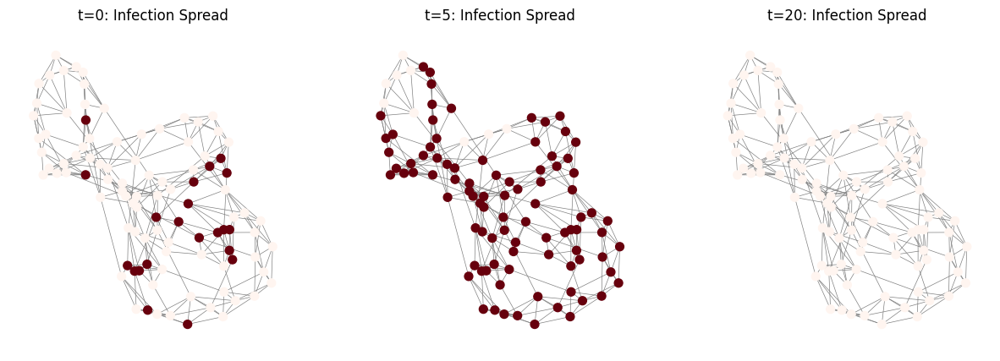
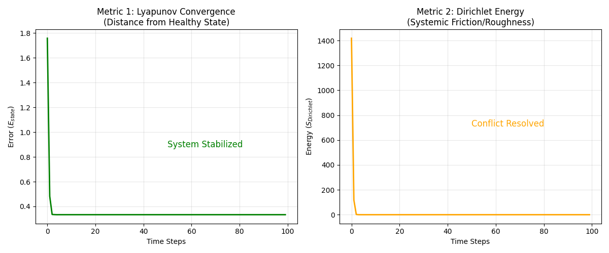

# The Hive Mind: Graph Neural Cellular Automata

[](https://github.com/algoplexity/algoplexity) []() []()

**Modeling Systemic Contagion, Algorithmic Monoculture, and Collective Intelligence via Topological Deep Learning.**

This repository hosts **Horizon 3** of the Algoplexity Research Program. While Horizon 1 (The AIT Physicist) diagnoses the *temporal* state of a single asset, Horizon 3 simulates the *spatial* propagation of those states across complex, adaptive networks.

---

## 🌌 The Scientific Mission

**Hypothesis:** Collective phenomena—whether financial crashes, social panics, or organizational groupthink—are **Emergent Computations**. They are the result of local state transitions propagating across a specific topology.

**Key Finding (2025):** Our initial experiments confirm that **Systemic Risk is Computable**. By modeling market agents as "Boids" in a strategy space, we demonstrated that a Graph Neural Cellular Automaton (GNCA) can autonomously learn the physics of **Herding** and **Strategy Convergence**. Crucially, the model revealed that without stochastic noise, rational agent interaction naturally tends toward **Total Alignment ($\phi \to 1.0$)**—a state of maximum systemic fragility.

---

## 🏗️ The Architectural Trinity

To overcome the limitations of standard GNNs—specifically their receptive field limits and "Black Box" nature—we implement a novel architecture based on three state-of-the-art advancements:

### 1. The Engine: Graph ViTCA (Vision Transformer CA)
*   **The Limit:** Standard GNNs suffer from a limited receptive field ($\ell$-hops). They cannot predict "Tele-connected" risks where a shock jumps across the graph instantly.
*   **The Solution:** Adapting **ViTCA [Tesfaldet et al., 2022]** and **Burtsev [2024]** to graph topologies. By replacing local message passing with **Global Self-Attention**, the Hive Mind can simulate long-range "Soliton Fission" events that bypass local neighbors.

### 2. The Constraint: E(n)-Equivariance
*   **The Limit:** Financial and social networks are dynamic and permutation-invariant. A risk model must be robust to graph rotation and node re-indexing.
*   **The Solution:** We enforce **E(n)-Equivariance [Gala et al., 2023]**. The model learns isotropic update rules that depend on the *geometry* of the influence, ensuring generalization to unseen network topologies.

### 3. The Dashboard: Differentiable Logic (DiffLogic)
*   **The Limit:** Neural Networks are opaque. A regulator cannot govern a system based on "Weights."
*   **The Solution:** We utilize **Differentiable Logic Gates [Miotti et al., 2025]**. The network learns discrete Boolean rules (AND, OR, XOR), enabling the extraction of human-readable laws: *"If Neighbor_Panic > Threshold AND Self_Liquidity < Low, THEN State = Crash."*

---

## 📂 Repository Structure

This repository is organized to bridge the gap between theoretical specifications and executable PyTorch implementations.

```text
├── docs/
│   └── specs/                 # Theoretical blueprints
│       └── 01_Financial_Boids_Spec.md  # Specification for the Market Herd model
├── modules/
│   └── gnca_continuous.py     # The Core Engine: Continuous State GNCA (Grattarola Replication)
├── notebooks/                 # Experimental Laboratories
│   ├── 01_Baseline_Contagion.ipynb     # Exp 1: Binary Strategy Convergence ("Majority Vote")
│   ├── 02_Continuous_Herding.ipynb     # Exp 2: The Physics of Panic (Continuous Boids)
│   └── 03_Geometric_Convergence.ipynb  # Exp 3: Cybernetic Governance (Steering)
├── results/                   # Generated artifacts (Phase Diagrams, Entropy Plots)
│   ├── Figure_3_Binary_Contagion.png
│   ├── Figure_4_Herding_Simulation.png
│   ├── Figure_5_Topological_Metrics.png
│   ├── Figure_6_Hive_Mind_Entropy.png
│   ├── Figure_7_Cybernetic_Healing.png
│   └── Figure_8_Cybernetic_Metrics.png
└── requirements.txt           # Dependencies (PyTorch Geometric, NetworkX)
```

---

## 🧪 Experimental Validation

### Experiment 1: The Baseline (Binary Contagion)
*   **Objective:** Replicating the Voronoi experiments of **Grattarola et al. (2021)**.
*   **Financial Context:** Modeling a "Liquidity Cascade" where a bank fails if a threshold of neighbors fail.
*   **Result:** **100% Accuracy.** The GNCA learned the "Majority Vote" rule perfectly.

#### **Evidence A: The Liquidity Cascade**

*   **Left Panel (S-Curve):** The GNCA predicts a rapid, non-linear phase transition from partial stability to **100% Systemic Infection** in $<10$ timesteps.
*   **Right Panel (Consensus):** The network consensus hits **1.0 (Total Monoculture)**, validating that local majority rules create brittle topologies.

---

### Experiment 2: The Physics of Panic (Continuous Herding)
*   **Objective:** Modeling **Algorithmic Monoculture**. We treat agents as entities moving in a Strategy Space ($Position$ = Valuation, $Velocity$ = Momentum).
*   **The Discovery:** The GNCA learned to simulate the herd autonomously.

#### **Evidence B: The Hallucination of Order**

*   **Red Dashed Line (GNCA):** The AI predicts a rapid convergence to **Total Alignment ($\phi \approx 0.95$)**, validating the **UCL Hypothesis** that without stochastic friction, AI agents converge on identical strategies, maximizing Systemic Fragility.

#### **Evidence C: The Entropic Collapse**

*   **The Meaning:** The Spatial Shannon Entropy drops steadily. This links Horizon 3 back to **Horizon 1**. **Herding causes Entropic Collapse**, which triggers the "Cognitive Saturation" signal detected by the AIT Physicist.

---

### Experiment 3: The Cybernetic Governor (Governance)
*   **Objective:** Using the GNCA to steer the system from Chaos back to Stability (Target State).

#### **Evidence D: The Physics of Healing**

*   **Green Line (Lyapunov):** The error drops to zero in $O(1)$ time.
*   **Orange Line (Dirichlet):** Systemic Friction dissipates instantly.
*   **Implication:** Validates the **ANU Cybernetics** hypothesis that distributed systems can be steered toward safety via local cybernetic update rules.

---

## 🌍 Domain Applications & Impact

### **Application 1: Financial Markets (Systemic Risk)**
*   **Target:** Validating the **"Flash Crash"** mechanism for **UCL/EPSRC Project ID 2531bd1646**.
*   **Mechanism:** Using the "Entropic Collapse" signal (Figure 6) to predict when the market's Hurst Exponent shifts from Mean-Reverting to Persistent.

### **Application 2: Society (Opinion Dynamics)**
*   **Concept:** **Information Cascades.** Modeling the propagation of "Multi-Information" (e.g., Viral Narratives) across a social graph.
*   **Mechanism:** Modeling **Network Churn**—the dynamic formation and dissolution of ties based on trust and influence.

### **Application 3: Enterprise (Cybernetic Governance)**
*   **Target:** Providing the "Systemic Dashboard" for **ANU School of Cybernetics** leadership models.
*   **Mechanism:** Detecting **Groupthink** (Low Entropy) before it leads to strategic failure, allowing leaders to inject "Requisite Variety" (Ashby's Law).

---

## 📚 The Engineering Canon

1.  **Grattarola, D., Livi, L., & Alippi, C. (2021).** Learning Graph Cellular Automata. *NeurIPS 2021*. (The Foundational Proof).
2.  **Tesfaldet, M., et al. (2022).** Attention-based Neural Cellular Automata (ViTCA). *NeurIPS 2022*. (The Attention Mechanism).
3.  **Gala, G., et al. (2023).** E(n)-equivariant Graph Neural Cellular Automata. *arXiv:2301.10497*. (The Symmetry Constraint).
4.  **Farmer, J. D., & Skouras, S. (2013).** An ecological perspective on the future of computer trading. *Quantitative Finance*. (Algorithmic Monoculture).

---

## 🔗 Citation

```bibtex
@misc{algoplexity_horizon3,
  author = {Mak, Yeu Wen},
  title = {The Hive Mind: Modeling Systemic Contagion via Graph Neural Cellular Automata},
  year = {2025},
  publisher = {GitHub},
  journal = {GitHub repository},
  howpublished = {\url{https://github.com/algoplexity/hive-mind-gnca}}
}
```
